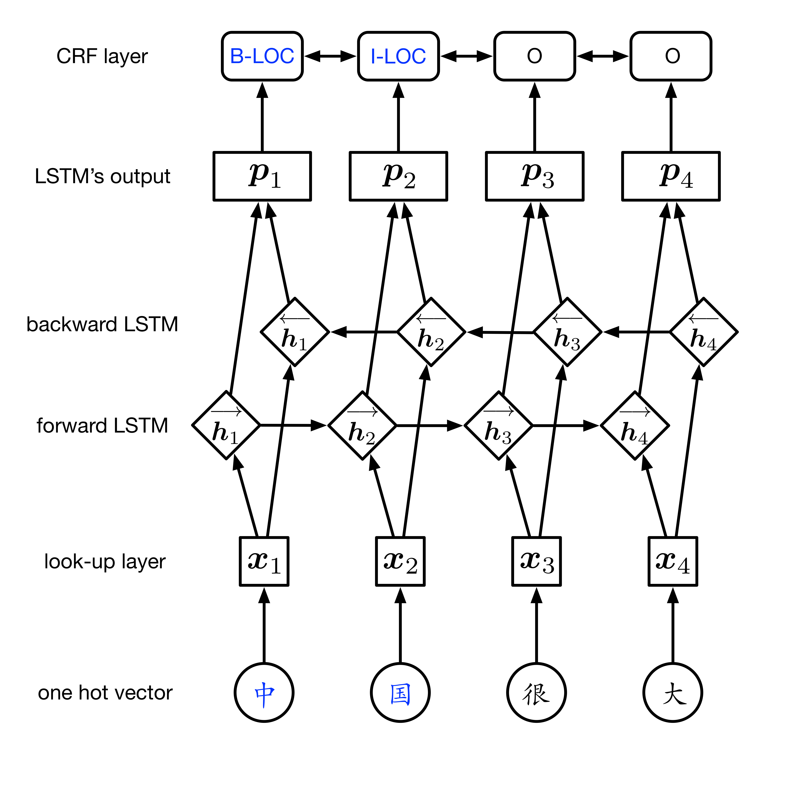

# BiLSTM-CRF 模型实现中文命名实体识别

---

> 基于 ___character-based BiLSTM-CRF sequence labelling model___ 实现中文命名实体识别任务。

模型运行环境：

> - python 3.5
> - tensorflow 1.2.0

---

## Model

### 模型架构

模型主要基于 [Bidirectional LSTM-CRF Models for Sequence Tagging][1] 和 [Neural Architectures for Named Entity Recognition][2] 两篇论文，模型结构如下：

对于每一个输入的中文语句，语句中的每个字都会对应于集合{0，B-PER，I-PER，B-LOC，I-LOC，B-ORG，I-ORG}中的一个tag。

模型的第一个layer (__look-up layer__)，用于将字的one-hot向量表示转化为 *character embedding（词嵌入）* 。在本模型实现中，并没有提前训练好Word2vec向量模型对字进行初始化，而仅仅是简单的随机初始化，此处是以后待改进的一个地方。

模型的第二个layer (__BiLSTM layer__)，双向的lstm模型能有效地利用 *past and future（过去和未来）* 的信息，自动提取特征。

模型的第三个layer (__CRF layer__)， 对每句话中的标签进行标注。如果我们用 __Softmax layer__ 进行标注，我们将得到无语法结构的标注答案， 因为 softmax 无法独立地对每个位置进行标注。

---

## Train

> python main.py --mode=train

---

## Test

这里主要有两种方式进行test

#### 1.直接加载 saver.save 保存的模型

> python main.py --mode=test --demo_model=XXXXX

这里需要自己设置demo model的版本

#### 2.加载 saved_model 保存的模型

因为需要进行线上部署，saver.save 保存的模型需要线上部署一套 tensorflow的环境，而且需要重新搭建一套网络结构，
使用 saved_model 既可以将网络结构保存下来，也可以将网络参数保存下来，这样线上部署时不用再去搭建和线下相同的
网络结构。

> python restore.py

可以实现模型的加载可预测

---

> 2017/09/22 新增业务实体

新增业务实体，表示为OTH